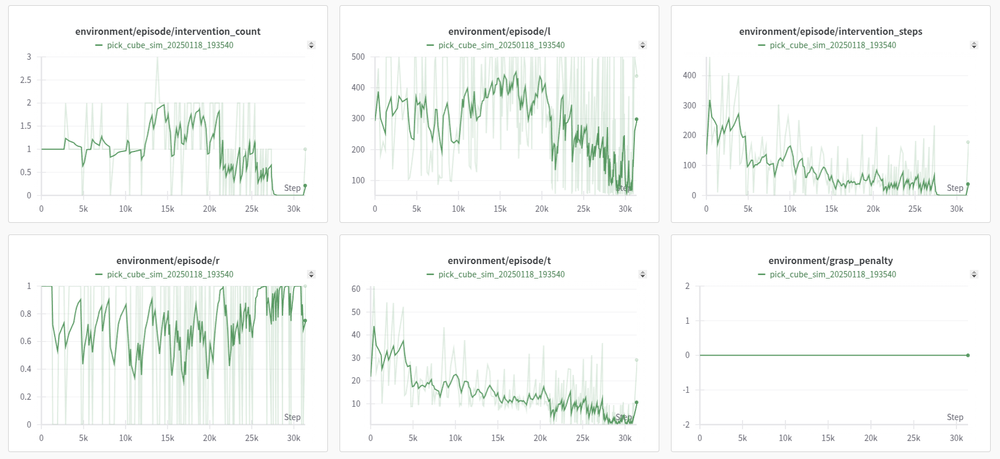

# Simulation implement of HIL-SERL

[](https://opensource.org/licenses/Apache-2.0)
[](https://hil-serl.github.io/)
[](https://discord.gg/G4xPJEhwuC)


## Original Project
HIL-SERL: Precise and Dexterous Robotic Manipulation via Human-in-the-Loop Reinforcement Learning

**Webpage: [https://hil-serl.github.io/](https://hil-serl.github.io/)**

HIL-SERL is a system for training state of the art manipulation policies using Reinforcement Learning.

We first tele-operate the robot to collect positive and negative samples and train a binary reward classifier.
We then collect a small set of demonstrations, which is added to the demo buffer at the start of RL training.
During online training, we use the binary classifier as a sparse reward signal and provide human interventions. Initially, we provide more frequent interventions to demonstrate ways of solving the task from various states and prevent the robot from performing undesirable behavior. We gradually reduce the amount of interventions as the policy reaches higher success rate and faster cycle times.

## Our main Contribution
Our project extends the hil-serl framework, which is designed for real-world robotic tasks using the Franka robot. The original implementation requires physical hardware and relies on neural networks to evaluate task success, making it challenging for developers to test and adapt the code for their specific needs. 

To address these limitations, we developed a simulation environment based on the suggestion from this [issue](https://github.com/rail-berkeley/serl/issues/37). By adapting the [SERL](https://github.com/rail-berkeley/serl) codebase, we created a lightweight simulation environment that allows developers to test and debug their implementations without needing physical hardware. 

This significantly lowers the barrier to entry, accelerates development, and makes the hil-serl framework more accessible to researchers and developers.


## Installation
1. **Setup Conda Environment:**
    create an environment with
    ```bash
    conda create -n hilserl python=3.10
    ```

2. **Install pytorch**
   
   pip install torch==2.3.0 torchvision==0.18.0 torchaudio==2.3.0 --index-url https://download.pytorch.org/whl/cu121 -i https://pypi.tuna.tsinghua.edu.cn/simple


3. **Install Jax as follows:**
    - For CPU (not recommended):
        ```bash
        pip install --upgrade "jax[cpu]"
        ```

    - For GPU:
        ```bash
        pip install --upgrade "jax[cuda12_pip]==0.4.35" -f https://storage.googleapis.com/jax-releases/jax_cuda_releases.html
        ```

    - For TPU
        ```bash
        pip install --upgrade "jax[tpu]" -f https://storage.googleapis.com/jax-releases/libtpu_releases.html
        ```
    - See the [Jax Github page](https://github.com/google/jax) for more details on installing Jax.

4. **Install the serl_launcher**
    ```bash
    cd serl_launcher
    pip install -e .
    pip install -r requirements.txt
    ```


## Overview and Code Structure

HIL-SERL provides a set of common libraries for users to train RL policies for robotic manipulation tasks. The main structure of running the RL experiments involves having an actor node and a learner node, both of which interact with the robot gym environment. Both nodes run asynchronously, with data being sent from the actor to the learner node via the network using [agentlace](https://github.com/youliangtan/agentlace). The learner will periodically synchronize the policy with the actor. This design provides flexibility for parallel training and inference.

<!-- <p align="center">
  
</p> -->

**Table for code structure**

| Code Directory | Description |
| --- | --- |
| [examples](examples) | Scripts for policy training, demonstration data collection, reward classifier training |
| [serl_launcher](/serl_launcher) | Main code for HIL-SERL |
| [serl_launcher.agents](/serl_launcher/serl_launcher/agents/) | Agent Policies (e.g. SAC, BC) |
| [serl_launcher.wrappers](/serl_launcher/serl_launcher/wrappers) | Gym env wrappers |
| [serl_launcher.data](serl_launcher/serl_launcher/data) | Replay buffer and data store |
| [serl_launcher.vision](serl_launcher/serl_launcher/vision) | Vision related models and utils |
| [serl_robot_infra](./serl_robot_infra/) | Robot infra for running with real robots |
| [serl_robot_infra.robot_servers](serl_robot_infra/robot_servers/) | Flask server for sending commands to robot via ROS |
| [serl_robot_infra.franka_env](/serl_robot_infra/franka_env/) | Gym env for Franka robot |
| [examples.experiments.pick_cube_sim](examples/experiments/pick_cube_sim)| Scripts and configuration file for simulation training.
| [franka_sim](franka_sim)| Main code to build up simulation environment.

## Quick Start

Here, we will tell you how to use hil-serl to train Franka Arm in Simulation environment(pick_cube_sim). The goal of this environment is to capture randomly appearing blocks in space and raise them by 0.1m in the z-direction.

1. Change directory to target folder

    cd examples/experiments/pick_cube_sim/

2. Try the control the robot in simulation environment. You can familiarize yourself with our simulation environment through a simple demo, such as how humans intervene and control, controlling the robotic arm to complete tasks.
   
   python ../../../env_test.py

   In this setup, we are looking forward from the base of the Franka robot. The control keys are defined as follows:

    `W` Move forward;  `S` Move backward;  `A` Move left; `D` Move right; `J` Move up; `K` Move down; `L` Open/Close gripper; `;` Human intervention open/close

3. Collect demo data. 20 means we need to collect 20 successful human teleoperation trajectories. Afterwards, the collected trajectories will be saved in the path `examples/experiments/pick_cube_sim/demo_data`.

    python ../../record_demos.py --exp_name pick_cube_sim --successes_needed 20

4. Start human-in-loop RL training. Before runnning the following two bash file, you need to check and update `run_actor.sh` and `run_learner.sh`. For example the *exp_name* must be one of the folder name in experiments, the *demo_path* need to be the absolute path of your `.pkl` file(not relative path).

    bash run_actor.sh --checkpoint_path first_run
    bash run_learner.sh

5. Evaluate our final policy. You can modify the parameters according to your needs.

    bash run_actor.sh --eval_checkpoint_step=30000 and --eval_n_trajs=100 --checkpoint_path=first_run


## Results
After 30000 steps of training(about 1 hours) and human's intervention, our policy can achieve 100% of success in pick_cube_sim environment. Here is our training curve and final policy out come.



<div style="text-align:center;">Training Curve</div>


<div style="text-align:center;">Policy Performance</div>

## Citation

If you use this code for your research, please cite the following two papers:

hil-serl
```bibtex
@misc{luo2024hilserl,
      title={Precise and Dexterous Robotic Manipulation via Human-in-the-Loop Reinforcement Learning},
      author={Jianlan Luo and Charles Xu and Jeffrey Wu and Sergey Levine},
      year={2024},
      eprint={2410.21845},
      archivePrefix={arXiv},
      primaryClass={cs.RO}
}
```

And serl
```
@misc{luo2024serl,
      title={SERL: A Software Suite for Sample-Efficient Robotic Reinforcement Learning},
      author={Jianlan Luo and Zheyuan Hu and Charles Xu and You Liang Tan and Jacob Berg and Archit Sharma and Stefan Schaal and Chelsea Finn and Abhishek Gupta and Sergey Levine},
      year={2024},
      eprint={2401.16013},
      archivePrefix={arXiv},
      primaryClass={cs.RO}
}
```